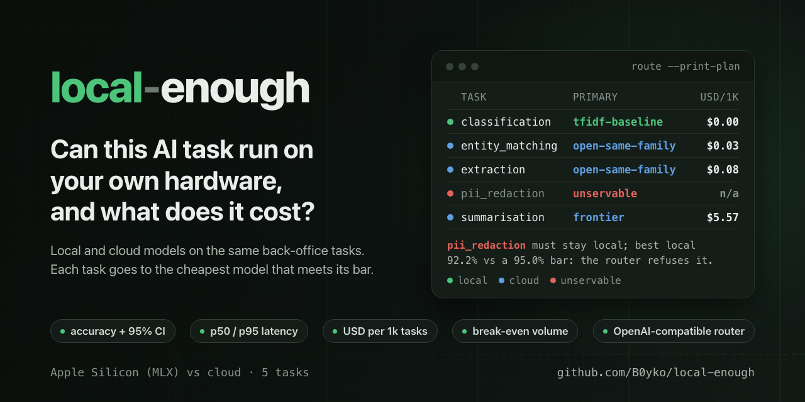
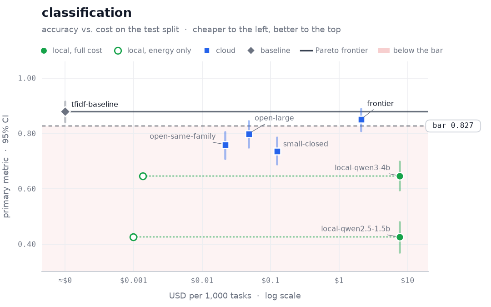
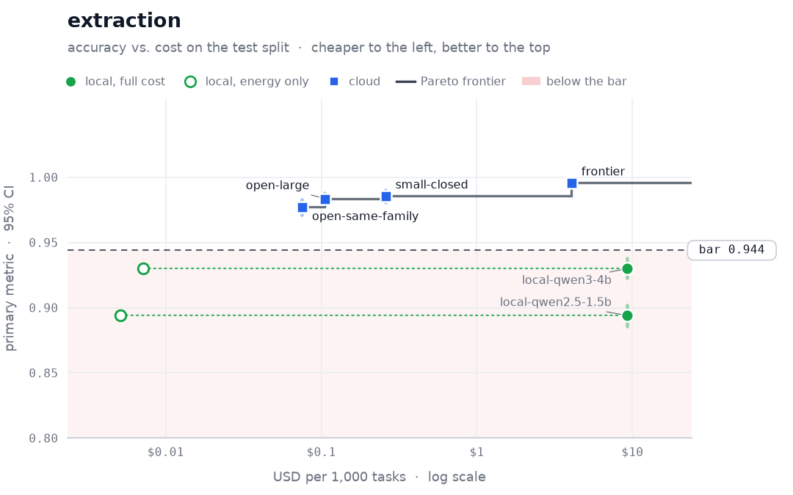
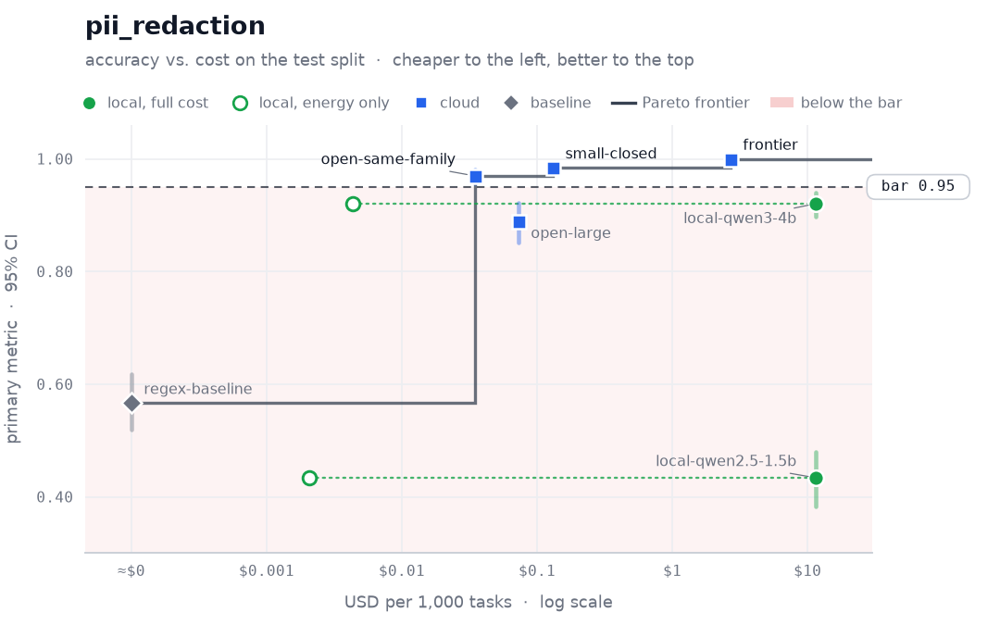
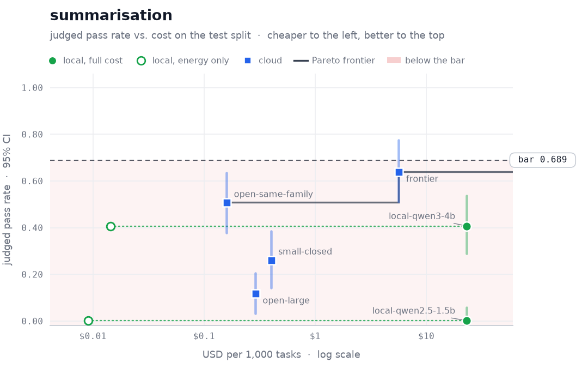
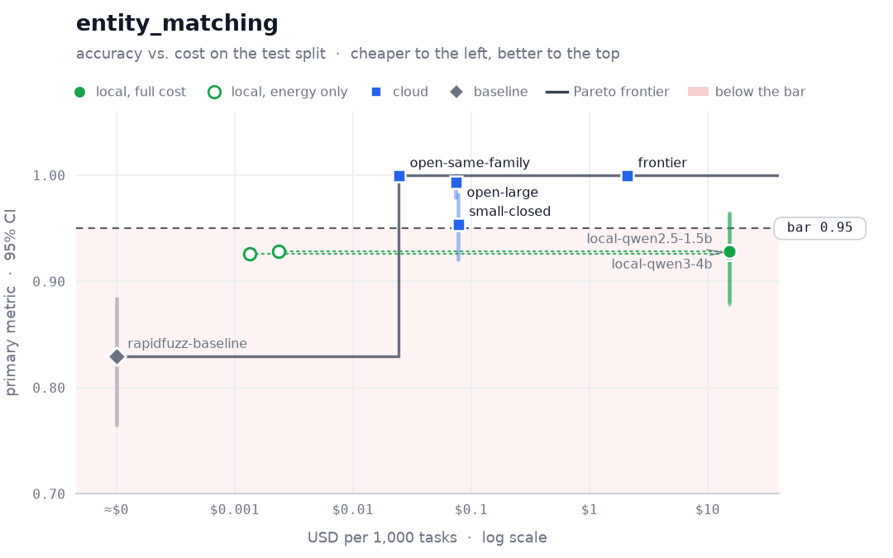
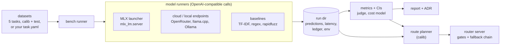

<p align="center">
  
</p>

<p align="center">
  <b>Measured answers to "can we run this back-office AI task on our own hardware, and what does it cost?"</b>
</p>

<p align="center">
  <a href="https://github.com/B0yko/local-enough/actions/workflows/ci.yml"></a>
  <a href="https://github.com/B0yko/local-enough/releases"></a>
  <a href="LICENSE"></a>
  <a href="pyproject.toml"></a>
  <a href="https://github.com/B0yko/local-enough/pkgs/container/local-enough"></a>
  <a href="#quickstart"></a>
</p>

<p align="center">
  <a href="#the-evidence">Evidence</a> ·
  <a href="#quickstart">Quickstart</a> ·
  <a href="#how-it-works">How it works</a> ·
  <a href="#results">Results</a> ·
  <a href="#the-router">Router</a> ·
  <a href="#limitations">Limitations</a>
</p>

> [!IMPORTANT]
> **Measured verdict, reference run.** <!-- le:headline:start -->
Local failed the quality bar on most tasks: on the calib split a local candidate met it on only 2 of 5, classification (the TF-IDF baseline, no LLM) and entity_matching (local-qwen2.5-1.5b); pii_redaction, which must stay local, missed its bar (best local f2 92.2% vs 95.0%), so the router refuses it. The headline task, classification, has no break-even volume to compute: no cloud model met its bar (volume: 15,000 tasks/month). The router (gates, no route.yaml constraints) costs 76.9% less on the mixed workload than all traffic to the frontier model (no single cloud model meets every bar).
<!-- le:headline:end -->

| Measure it | Price it | Route it |
|:--|:--|:--|
| Local models on Apple Silicon and cloud models run the same five back-office tasks (CRM extraction, intent classification, PII redaction, meeting summaries, vendor-record matching) with the same prompt: accuracy against gold labels with confidence intervals, output validity, p50/p95 latency and throughput. | USD per 1,000 tasks, including amortised hardware and energy, and the monthly volume at which the local machine breaks even, with a capacity check. The result is a decision report with a filled-in ADR. | An OpenAI-compatible router sends each task to the cheapest model that met the quality bar and escalates when deterministic evidence checks fail. Tasks that must stay local never reach a cloud endpoint. |

| **Reference run** | Mac Studio (2025, Apple M4 Max 16-core CPU / 40-core GPU, 128 GB), $4,099 list price |
|:--|:--|
| **Line-up** | local MLX models, four cloud models on OpenRouter and three baselines (TF-IDF, regex, rapidfuzz) |
| **Measured** | accuracy with confidence intervals, invalid output, p50/p95 latency, throughput, USD per 1,000 tasks, break-even volume |
| **Soak** | 20 minutes; throttle factor 0.981 (1.5B) and 1.023 (4B, applied as 1.0): no slowdown to speak of |
| **Energy** | 6 W idle, 139 W incremental, from Apple's published figures (an upper bound) |
| **Spend** | $5.77 in paid API calls for the whole reference run (benchmark, judge calibration and scoring) |
| **Reproduce** | every table offline from the committed run; CI fails if the README drifts from it |

## The evidence

Accuracy against cost on the `test` split, one chart per task; the dashed line is the quality bar set on `calib`.

<p align="center">
<picture>
  <source media="(prefers-color-scheme: dark)" srcset="docs/img/classification-dark.png">
  
</picture>
</p>

<table>
  <tr>
    <td><picture>  <source media="(prefers-color-scheme: dark)" srcset="docs/img/extraction-dark.png">  </picture></td>
    <td><picture>  <source media="(prefers-color-scheme: dark)" srcset="docs/img/pii_redaction-dark.png">  </picture></td>
  </tr>
  <tr>
    <td><picture>  <source media="(prefers-color-scheme: dark)" srcset="docs/img/summarisation-dark.png">  </picture></td>
    <td><picture>  <source media="(prefers-color-scheme: dark)" srcset="docs/img/entity_matching-dark.png">  </picture></td>
  </tr>
</table>

The routing plan the reference run produces (`local-enough route --print-plan --run reference`):

<!-- le:plan:start -->
```text
TASK             STATUS      BAR    PRIMARY           FALLBACKS            GATE         USD/1K
---------------  ----------  -----  ----------------  -------------------  -----------  ------
classification   served      0.827  tfidf-baseline    -                    format-only  0.00  
entity_matching  served      0.950  open-same-family  open-large           passed       0.03  
extraction       served      0.944  open-same-family  open-large,frontier  passed       0.08  
pii_redaction    unservable  0.950  -                 -                    disabled     n/a   
summarisation    served      0.689  frontier          -                    passed       5.57  
```
<!-- le:plan:end -->

## Quickstart

Python 3.12 and [uv](https://docs.astral.sh/uv/). The steps below use
`uv tool install git+https://github.com/B0yko/local-enough@v0.1.0`, which puts `local-enough` on your PATH.
Steps 1 and 2 take under 5 minutes.

> [!TIP]
> One command runs the CLI without installing anything:
>
> ```bash
> uvx --from git+https://github.com/B0yko/local-enough@v0.1.0 local-enough --help
> ```

**1. Offline, no keys.** Reproduce every table in this README from the committed reference run:

```bash
local-enough report --run reference --out report/      # report/index.html, report.md, ADR-local-vs-cloud.md
local-enough route --simulate --run reference          # the mixed-workload router table
```

**2. Live, one OpenRouter key, under $0.05.** One inexpensive cloud model and the three non-LLM baselines on 10
calib items per task:

```bash
local-enough init my-eval && cd my-eval               # config.yaml, quickstart.yaml, local.yaml, route.yaml, ...
export OPENROUTER_API_KEY=...                          # or fill .env, then: set -a; . ./.env; set +a
local-enough bench --tasks all --models quickstart.yaml --split calib --limit 10 --dry-run   # estimate first
local-enough bench --tasks all --models quickstart.yaml --split calib --limit 10
local-enough report
```

**3. Local, no key (Apple Silicon).** Download the 1.5B model (0.88 GB; about 40 s on the connection used for the
reference run), benchmark it, serve it behind the router and call it with the official `openai` client:

```bash
local-enough models pull --models local.yaml
local-enough bench --tasks all --models local.yaml --split calib --limit 10 --run runs/local
local-enough route --run runs/local --models local.yaml   # serves http://127.0.0.1:8000/v1
```

```python
from openai import OpenAI

client = OpenAI(base_url="http://127.0.0.1:8000/v1", api_key="unused")
email = (
    "Date: Monday, 14 Sep 2026\nFrom: Dana Reyes <dana.reyes@brightwell.example.com>\n\n"
    "Brightwell Facilities Ltd would like a demo of GuardPoint FM for 40 seats next Tuesday. "
    "Call me on +44 7700 900123."
)
reply = client.chat.completions.create(model="local-enough/extraction", messages=[{"role": "user", "content": email}])
print(reply.model)  # the local model that answered: <repo>@<sha>
print(reply.choices[0].message.content)  # the CRM fields as JSON
```

> [!NOTE]
> For exact reproduction of the reference environment use `git clone https://github.com/B0yko/local-enough && cd
> local-enough && uv sync --locked` (`uvx --from git+...` ignores `uv.lock`; the `mlx` and `mlx-lm` lower bounds are
> the benchmarked versions). On Linux `mlx-lm` is not installed and only cloud and OpenAI-compatible endpoints are
> available.

## How it works



<details>
<summary><b>What each stage does</b> · prompts and parsing, measurement passes, cost, judge, routing</summary>

1. **Bench.** Every model sees the same prompt and the same lenient parser (code fences and `<think>` stripped, first
   JSON value or first line), at temperature 0 with a per-task output cap. Unparseable or schema-invalid output is
   scored as wrong and counted in `invalid_output_rate`; there are no repair retries. Cloud calls run with bounded
   concurrency and up to 3 retries on 429/5xx/timeouts. Local `launch: mlx` models are started and stopped by the CLI
   (`python -m mlx_lm.server` on 127.0.0.1, offline, pinned snapshot). Every paid call goes through one cost ledger
   that reserves an upper bound before sending and refuses calls that would pass the budget cap.
2. **Measure.** Pass A gives quality and per-item latency (local at concurrency 1), Pass B throughput at
   concurrency 4, Pass C a 20-minute soak for the throttle factor; peak memory comes from `footprint`, power from
   battery telemetry where it exists. A load sampler marks any measurement window with other work on the machine.
3. **Cost.** Local cost per task = amortised hardware + idle energy spread over the task's monthly volume, plus
   energy per task at sustained throughput; break-even and capacity follow ([docs/cost-model.md](docs/cost-model.md),
   [ADR 4](docs/adr/0004-cost-model.md)).
4. **Judge.** Summaries are graded by an LLM judge whose per-fact verdicts feed a pass rule in code; the judge is
   calibrated on construction-labelled summaries and its pass rate is bias-corrected (Rogan–Gladen).
5. **Route.** The planner keeps, per task, the candidates that met the quality bar on `calib`, orders them by USD per
   task and builds a fallback chain. The router applies the benchmarked prompt, runs deterministic gates and escalates
   on errors or failed gates ([ADR 1](docs/adr/0001-deterministic-gates.md)).

</details>

## Results

Reference run on a Mac Studio (2025, Apple M4 Max 16-core CPU / 40-core GPU, 128 GB), four cloud models on
OpenRouter and three baselines. Every table below is generated from the committed run by `local-enough report --run
reference` or `local-enough route --simulate --run reference`, and CI fails if the README drifts from it
(`scripts/check_readme.py`). `calib` decides every routing choice and verdict; every number shown is on `test`.

### Verdict per task

<!-- le:verdicts:start -->
Verdict rule, decided on the calib split: **local** when a local candidate meets the quality bar and this task's monthly volume is at or above the break-even volume against the cheapest cloud model meeting the bar (itself at or below this machine's capacity); **local (constraint)** when the task is in `data_must_stay_local` and a local candidate meets the bar, whatever the break-even; **local — below bar (constraint)** when the task is in `data_must_stay_local` and no local candidate meets the bar; **hybrid** when local meets the bar only through the router, with escalation to cloud at or below 20%; otherwise **cloud**.

| task | verdict | detail |
|---|---|---|
| classification | local | the TF-IDF baseline (no LLM) meets the bar at about $0 per task, so there is no hardware to pay back at this task's volume (15,000 tasks/month). |
| entity_matching | cloud | local alone is cheaper only above 4,995,204 tasks/month; the served plan has no local primary that meets the bar with at most 20% escalation. |
| extraction | cloud | local alone is below the bar (gap to bar: -1.8%); the served plan has no local primary that meets the bar with at most 20% escalation. |
| pii_redaction | local — below bar (constraint) | data_must_stay_local; no local candidate meets the bar (gap to bar: -2.8%). |
| summarisation | cloud | local alone is below the bar (gap to bar: -31.1%); the served plan has no local primary that meets the bar with at most 20% escalation. |
<!-- le:verdicts:end -->

### Detailed tables

<details>
<summary><b>Setup</b> · machine, software versions, prices, local and cloud models, split sizes</summary>

<!-- le:setup:start -->
| field | value |
|---|---|
| hardware | mac-studio-m4-max-128gb |
| machine | Mac Studio (Mac16,9), Apple M4 Max, 128 GB |
| macOS | 26.5.2 (25F84) |
| mlx | 0.32.2 |
| mlx-lm | 0.31.3 |
| judge model | openai/gpt-4.1-mini |
| run date | 2026-09-28 |
| hardware price | $4,099 (list price), source: https://web.archive.org/web/20250315063017/https://www.apple.com/shop/buy-mac/mac-studio/apple-m4-max-with-14-core-cpu-32-core-gpu-16-core-neural-engine-36gb-memory-512gb, 2025-03-15 |
| electricity price (assumption) | 0.30 USD/kWh |
| power | configured: 6 W idle, 139 W incremental, from Apple's published figures; no battery telemetry on a desktop |
| measurement windows | 6 load-sample windows, 0 flagged contaminated |
| total API spend | $5.77 |


**Local models**

| id | repo | revision | size on disk |
|---|---|---|---|
| local-qwen3-4b | mlx-community/Qwen3-4B-Instruct-2507-4bit | 50d427756c6b1b2fe0c0a10f67fbda1fc8e82c1b | 2.28 GB |
| local-qwen2.5-1.5b | mlx-community/Qwen2.5-1.5B-Instruct-4bit | 8b403126fc14f14cfc99bb4cfa72ecbc129ea677 | 0.88 GB |


**Cloud models** (price snapshot: 2026-09-28)

| id | role | model | Pass A calls | retries | failed after retries | spend |
|---|---|---|---|---|---|---|
| frontier | frontier | x-ai/grok-4.7 | 1,482 | 0 | 0 | $4.35 |
| small-closed | small-closed | openai/gpt-5.4-nano | 1,482 | 0 | 0 | $0.25 |
| open-large | open-large | deepseek/deepseek-v3.2 | 1,482 | 0 | 0 | $0.14 |
| open-same-family | open-same-family | qwen/qwen3-235b-a22b-2507 | 1,482 | 125 | 1 | $0.07 |


**Split sizes**

| task | calib | test |
|---|---|---|
| classification | 154 | 308 |
| entity_matching | 100 | 200 |
| extraction | 100 | 200 |
| pii_redaction | 100 | 200 |
| summarisation | 40 | 80 |
<!-- le:setup:end -->

`openai/gpt-5.4-nano` does not accept `temperature`, so OpenRouter drops the `temperature: 0` sent to it; every other
model received it. The four cloud ids, their request settings and the reasons for them are in
[ADR 7](docs/adr/0007-model-lineup.md).

</details>

<details>
<summary><b>Quality, latency and cost per task</b> · one table per task with confidence intervals, calib bar and test hold-out</summary>

<!-- le:results:start -->
#### classification

Quality bar (calib): 82.7%. Split: test. Scenario: local dedicated at V_t.

| model | kind | accuracy (95% CI) | invalid % | p50 | p95 | $/1k tasks | meets bar (calib) | holds (test) |
|---|---|---|---|---|---|---|---|---|
| local-qwen2.5-1.5b | local | 42.5% [37.0%, 48.1%] | 3.2% | 0.10s | 0.12s | $7.68 (energy $0.0010) | no | no |
| local-qwen3-4b | local | 64.6% [59.4%, 69.8%] | 1.0% | 0.14s | 0.17s | $7.68 (energy $0.0014) | no | no |
| frontier | cloud | 85.1% [80.8%, 89.0%] | 0.0% | 2.62s | 9.23s | $2.08 | no | yes |
| open-large | cloud | 79.9% [75.0%, 84.4%] | 0.0% | 1.75s | 2.96s | $0.05 | no | no |
| open-same-family | cloud | 76.0% [70.8%, 80.5%] | 0.6% | 1.80s | 9.63s | $0.02 | no | no |
| small-closed | cloud | 73.7% [68.8%, 78.6%] | 0.0% | 0.76s | 1.13s | $0.12 | no | no |
| tfidf-baseline | baseline | 88.0% [84.1%, 91.6%] | 0.0% | 0.00s | 0.00s | $0.0000 | yes | yes |


Reproduce: `local-enough report --run reference`.

#### entity_matching

Quality bar (calib): 95.0%. Split: test. Scenario: local dedicated at V_t.

| model | kind | f1 (95% CI) | invalid % | p50 | p95 | $/1k tasks | meets bar (calib) | holds (test) |
|---|---|---|---|---|---|---|---|---|
| local-qwen2.5-1.5b | local | 92.6% [87.8%, 96.5%] | 0.0% | 0.14s | 0.14s | $15.36 (energy $0.0013) | yes | no |
| local-qwen3-4b | local | 92.9% [88.1%, 96.4%] | 0.0% | 0.25s | 0.26s | $15.36 (energy $0.0024) | no | no |
| frontier | cloud | 100.0% [100.0%, 100.0%] | 0.0% | 3.20s | 8.08s | $2.07 | yes | yes |
| open-large | cloud | 99.4% [97.9%, 100.0%] | 0.0% | 1.75s | 3.22s | $0.07 | yes | yes |
| open-same-family | cloud | 100.0% [100.0%, 100.0%] | 0.0% | 1.72s | 8.28s | $0.02 | yes | yes |
| small-closed | cloud | 95.4% [92.0%, 98.2%] | 0.0% | 0.76s | 1.15s | $0.08 | yes | yes |
| rapidfuzz-baseline | baseline | 83.0% [76.5%, 88.4%] | 0.0% | 0.00s | 0.00s | $0.0000 | no | no |


Calib-pass/test-fail: local-qwen2.5-1.5b.


Reproduce: `local-enough report --run reference`.

#### extraction

Quality bar (calib): 94.4%. Split: test. Scenario: local dedicated at V_t.

| model | kind | field_accuracy (95% CI) | invalid % | p50 | p95 | $/1k tasks | meets bar (calib) | holds (test) |
|---|---|---|---|---|---|---|---|---|
| local-qwen2.5-1.5b | local | 89.4% [88.6%, 90.2%] | 0.0% | 0.67s | 0.71s | $9.22 (energy $0.0051) | no | no |
| local-qwen3-4b | local | 93.0% [92.3%, 93.8%] | 0.0% | 1.20s | 1.30s | $9.22 (energy $0.0071) | no | no |
| frontier | cloud | 99.6% [99.3%, 99.8%] | 0.0% | 6.30s | 19.59s | $4.06 | yes | yes |
| open-large | cloud | 98.4% [97.9%, 98.8%] | 0.0% | 3.82s | 5.60s | $0.11 | yes | yes |
| open-same-family | cloud | 97.7% [97.1%, 98.3%] | 0.0% | 4.99s | 13.30s | $0.08 | yes | yes |
| small-closed | cloud | 98.6% [98.1%, 99.0%] | 0.0% | 1.52s | 2.07s | $0.26 | yes | yes |


Reproduce: `local-enough report --run reference`.

#### pii_redaction

Quality bar (calib): 95.0%. Split: test. Scenario: local dedicated at V_t.

| model | kind | f2 (95% CI) | invalid % | p50 | p95 | $/1k tasks | meets bar (calib) | holds (test) |
|---|---|---|---|---|---|---|---|---|
| local-qwen2.5-1.5b | local | 43.4% [38.2%, 47.9%] | 0.5% | 0.21s | 0.50s | $11.52 (energy $0.0021) | no | no |
| local-qwen3-4b | local | 92.0% [89.7%, 94.0%] | 0.0% | 0.60s | 1.36s | $11.52 (energy $0.0044) | no | no |
| frontier | cloud | 100.0% [100.0%, 100.0%] | 0.0% | 4.48s | 10.13s | $2.69 | yes | yes |
| open-large | cloud | 88.9% [85.2%, 92.1%] | 0.0% | 2.52s | 3.98s | $0.07 | no | no |
| open-same-family | cloud | 97.0% [95.6%, 98.2%] | 0.0% | 3.23s | 11.54s | $0.03 | yes | yes |
| small-closed | cloud | 98.4% [97.7%, 99.0%] | 0.0% | 1.32s | 2.08s | $0.13 | yes | yes |
| regex-baseline | baseline | 56.7% [51.9%, 61.7%] | 0.0% | 0.00s | 0.00s | $0.0000 | no | no |


Reproduce: `local-enough report --run reference`.

#### summarisation

Quality bar (calib): 68.9%. Split: test. Scenario: local dedicated at V_t.

| model | kind | pass_rate (95% CI) | invalid % | p50 | p95 | $/1k tasks | meets bar (calib) | holds (test) |
|---|---|---|---|---|---|---|---|---|
| local-qwen2.5-1.5b | local | 0.2% [0.0%, 5.8%] | 0.0% | 1.64s | 1.82s | $23.04 (energy $0.0090) | no | no |
| local-qwen3-4b | local | 40.7% [28.8%, 53.7%] | 0.0% | 1.73s | 1.87s | $23.05 (energy $0.01) | no | no |
| frontier | cloud | 63.9% [51.1%, 77.5%] | 0.0% | 7.54s | 16.63s | $5.64 | yes | no |
| open-large | cloud | 11.8% [3.1%, 20.4%] | 0.0% | 3.45s | 4.37s | $0.29 | no | no |
| open-same-family | cloud | 50.8% [37.7%, 63.4%] | 0.0% | 6.05s | 12.36s | $0.16 | no | no |
| small-closed | cloud | 26.2% [14.2%, 38.4%] | 0.0% | 1.59s | 2.15s | $0.40 | no | no |


Calib-pass/test-fail: frontier.


Reproduce: `local-enough report --run reference`.
<!-- le:results:end -->

</details>

<details>
<summary><b>Local performance</b> · throughput per concurrency, soak throttle, memory and power per local model</summary>

<!-- le:local_perf:start -->
#### local-qwen2.5-1.5b

| task | tasks/hour (c=1, Pass A) | tasks/hour (c=4, Pass B) | sustained tasks/hour (Pass B x throttle) | capacity (tasks/month) |
|---|---|---|---|---|
| classification | 34,674 | 42,939 | 42,128 | 10,110,735 |
| entity_matching | 25,646 | 31,828 | 31,226 | 7,494,360 |
| extraction | 5,379 | 8,275 | 8,119 | 1,948,567 |
| pii_redaction | 15,005 | 20,702 | 20,311 | 4,874,747 |
| summarisation | 2,660 | 4,700 | 4,611 | 1,106,657 |

| metric | value |
|---|---|
| first-5-min throughput (soak) | 12,072 |
| last-5-min throughput (soak) | 11,844 |
| throttle factor (last5/first5, full minutes) | 0.981 |
| throttle factor applied | 0.981 (soak (last 5 / first 5 full minutes)) |
| peak memory | 4.71 GB (footprint) |
| incremental watts | 139.0 W (configured) |
| idle watts | 6.0 W (configured) |

#### local-qwen3-4b

| task | tasks/hour (c=1, Pass A) | tasks/hour (c=4, Pass B) | sustained tasks/hour (Pass B x throttle) | capacity (tasks/month) |
|---|---|---|---|---|
| classification | 25,546 | 30,555 | 30,555 | 7,333,195 |
| entity_matching | 14,582 | 17,718 | 17,718 | 4,252,379 |
| extraction | 2,989 | 5,834 | 5,834 | 1,400,204 |
| pii_redaction | 5,319 | 9,540 | 9,540 | 2,289,666 |
| summarisation | 2,107 | 2,887 | 2,887 | 692,836 |

| metric | value |
|---|---|
| first-5-min throughput (soak) | 6,852 |
| last-5-min throughput (soak) | 7,008 |
| throttle factor (last5/first5, full minutes) | 1.023 |
| throttle factor applied | 1.000 (soak (last 5 / first 5 full minutes), capped at 1.0) |
| peak memory | 13.96 GB (footprint) |
| incremental watts | 139.0 W (configured) |
| idle watts | 6.0 W (configured) |


Both local models + router: 5.25 GiB (footprint; local-qwen2.5-1.5b 1.20 GiB, local-qwen3-4b 3.25 GiB, router 0.79 GiB); system memory in use at the time: 62.37 GiB of 128 GiB, 60.16 GiB before loading them (includes other workloads).


Reproduce: `local-enough bench --local-only --split test --concurrency 4`, `local-enough soak`.
<!-- le:local_perf:end -->

</details>

<details>
<summary><b>Measurement conditions</b> · one desktop on mains power, sampled background load, configured watts, list-price hardware</summary>

All local numbers come from one Mac Studio (desktop, mains power), with `caffeinate` spawned by `bench`, `soak` and
`power-probe`, and other heavy workloads on the machine paused during the measurement windows. Before and every 60 s
during each local pass (A, B, soak), a sampler recorded the CPU and memory in use by everything except local-enough's
own processes (system-wide counters, so other users' processes count too); a window is `contaminated` when that
exceeds one core for more than 10% of its samples, and none of the published windows was. Every sample of background
load was below one core (0.15 to 0.99) except the second sample of each Pass A and soak window: those windows were
recorded before a sampler fix, when the second sample came about a second after the first and read 0 to 15 cores from
counter priming, an artifact rather than load; the fixed sampler, used for Pass B, primes its counters and measures a
fresh interval.

Pass A runs local models at concurrency 1, Pass B at 4, and the 20-minute soak at 4 on the `workload_mix`. Sustained
throughput is Pass B × the soak's throttle factor (last five full minutes ÷ first five, capped at 1.0); on this
desktop it was 0.981 for the 1.5B model and 1.023 for the 4B model (applied as 1.0), so there was no slowdown to
speak of. Peak memory is the server's physical footprint (`/usr/bin/footprint`, which includes Metal allocations;
checked by comparing a loaded model's footprint with its size on disk). A desktop Mac has no battery telemetry, so
`power-probe` reports it unavailable and energy uses configured watts: 6 W idle and 145 − 6 = 139 W incremental, from
Apple's published Mac Studio (2025, M4 Max) figures ([support.apple.com/en-us/102027](https://support.apple.com/en-us/102027)),
an upper bound. Energy is a small part of local cost at these volumes either way. The hardware price is the US
apple.com list price of this configuration at launch ($1,999 base + $300 16-core/40-core chip + $1,200 128 GB + $600
2 TB = $4,099), read from Apple's archived configurator on 2025-03-15; the M4 Max model is no longer sold new.

</details>

<details>
<summary><b>Break-even</b> · dedicated machine per task: fixed cost, capacity, break-even volume, sensitivity</summary>

<!-- le:break_even:start -->
Scenario: dedicated (one machine per task at V_t).

| task | V_t (tasks/mo) | best local LLM | cheapest cloud (meets bar) | cloud $/1k | local energy $/1k | local fixed $/mo | break-even (tasks/mo) | capacity (tasks/mo) | machines needed | verdict |
|---|---|---|---|---|---|---|---|---|---|---|
| classification | 15,000 | local-qwen3-4b | none meets the bar | n/a | $0.0014 | $115.16 | n/a | 7,333,195 | 1 | n/a — no cloud model meets the bar |
| entity_matching | 7,500 | local-qwen2.5-1.5b | open-same-family | $0.02 | $0.0013 | $115.16 | 4,995,204 | 7,494,360 | 1 | break-even |
| extraction | 12,500 | local-qwen3-4b | open-same-family | $0.08 | $0.0071 | $115.16 | n/a | 1,400,204 | 1 | n/a — local below bar |
| pii_redaction | 10,000 | local-qwen3-4b | open-same-family | $0.03 | $0.0044 | $115.16 | n/a | 2,289,666 | 1 | n/a — local below bar |
| summarisation | 5,000 | local-qwen3-4b | frontier | $5.64 | $0.01 | $115.16 | n/a | 692,836 | 1 | n/a — local below bar |

Reproduce: `local-enough report --run reference`.
<!-- le:break_even:end -->

<!-- le:sensitivity:start -->
*(sensitivity grid not applicable: no cloud model meets the classification bar, so there is no break-even volume to vary)*
<!-- le:sensitivity:end -->

</details>

<details>
<summary><b>Router on the mixed workload</b> · shared machine: cost, bars met, local share and escalation per configuration</summary>

<!-- le:router:start -->
Scenario: shared machine (mixed workload, `workload_mix` weights, full test split). Source: `local-enough route --simulate --run reference`.

| configuration | USD / 1k mixed tasks | tasks meeting bar | served locally (LLM or baseline) | escalated | p50 / p95 s | saving vs all-frontier | saving vs cheapest cloud |
|---|---|---|---|---|---|---|---|
| All traffic to frontier (`frontier`) | $3.051 | 4/5 | 0.0% | 0.0% | 4.48 / 14.76 | n/a | n/a |
| Cheapest single cloud model meeting every bar: none | n/a | n/a | n/a | n/a | n/a / n/a | n/a | n/a |
| Router, primary only (no gates), no constraints | $0.594 | 4/5 | 30.0% | 0.0% | 2.72 / 11.20 | +80.5% | n/a |
| Router with gates, no constraints | $0.706 | 4/5 | 30.0% | 3.7% | 2.76 / 13.83 | +76.9% | n/a |
| Router with gates + data_must_stay_local (4/5 tasks served) | $0.873 | 3/5 | 37.5% | 4.1% | 1.98 / 14.58 | +72.2% | n/a |

Per-task primary metric against its calib bar:

| configuration | classification | entity_matching | extraction | pii_redaction | summarisation |
|---|---|---|---|---|---|
| All traffic to frontier (`frontier`) | 0.851 vs 0.827 (meets) | 1.000 vs 0.950 (meets) | 0.996 vs 0.944 (meets) | 1.000 vs 0.950 (meets) | 0.639 vs 0.689 (below) |
| Cheapest single cloud model meeting every bar: none | n/a | n/a | n/a | n/a | n/a |
| Router, primary only (no gates), no constraints | 0.880 vs 0.827 (meets) | 1.000 vs 0.950 (meets) | 0.977 vs 0.944 (meets) | 0.970 vs 0.950 (meets) | 0.575 vs 0.689 (below) |
| Router with gates, no constraints | 0.880 vs 0.827 (meets) | 1.000 vs 0.950 (meets) | 0.986 vs 0.944 (meets) | 0.980 vs 0.950 (meets) | 0.575 vs 0.689 (below) |
| Router with gates + data_must_stay_local (4/5 tasks served) | 0.880 vs 0.827 (meets) | 1.000 vs 0.950 (meets) | 0.986 vs 0.944 (meets) | unservable (503) | 0.575 vs 0.689 (below) |
<!-- le:router:end -->

</details>

<details>
<summary><b>Router live check</b> · sampled test requests through a running router, compared with the offline replay</summary>

<!-- le:live_check:start -->
| metric | value |
|---|---|
| n | 100 |
| seed | 7 |
| created | 2026-09-28T20:53:56Z |
| router overhead p50 | 6 ms |
| direct call p50 | n/a |
| router call p50 | 1430 ms |
| decision match rate | 99.0% |
| local-only requests that reached cloud | 0 |

No sampled request was answered by a local LLM in this plan, so there was nothing to call directly; overhead is the client latency minus the router's own upstream time.

21 request(s) were refused with HTTP 503, as the simulation predicts for them.

Mismatch on extraction item extraction-test-0090: router answered as 'x-ai/grok-4.7' (escalated=True), offline replay expected 'deepseek/deepseek-v3.2' (escalated=True).

A cloud answer can differ between the recorded bench call and the live call even at temperature 0, which can change a gate outcome and the escalation step.
<!-- le:live_check:end -->

</details>

<details>
<summary><b>Summarisation judge</b> · calibration against construction labels, per-model bias-corrected pass rates</summary>

<!-- le:judge:start -->
| field | value |
|---|---|
| judge model | openai/gpt-4.1-mini |
| n (judge-calib, selection) | 200 |
| n (judge-holdout, reported rates) | 200 |
| TPR | 88.7% |
| TNR | 97.6% |
| balanced accuracy | 93.2% |
| Cohen's kappa | 0.849 |
| target (>= 0.90 balanced accuracy) met? | yes |

**Per-model summarisation pass rates (test split)**

| model | n | raw pass rate | bias-corrected pass rate | 95% CI | key-token agreement |
|---|---|---|---|---|---|
| frontier | 80 | 57.5% | 63.9% | [51.1%, 77.5%] | 99.7% |
| local-qwen2.5-1.5b | 80 | 2.5% | 0.2% | [0.0%, 5.8%] | 69.3% |
| local-qwen3-4b | 80 | 37.5% | 40.7% | [28.8%, 53.7%] | 69.7% |
| open-large | 80 | 12.5% | 11.8% | [3.1%, 20.4%] | 92.7% |
| open-same-family | 80 | 46.2% | 50.8% | [37.7%, 63.4%] | 92.4% |
| small-closed | 80 | 25.0% | 26.2% | [14.2%, 38.4%] | 89.7% |
<!-- le:judge:end -->

</details>

<details>
<summary><b>Downloads and spend</b> · model snapshots with licences, the run's ledger and the project ledger</summary>

<!-- le:downloads:start -->
| model | repo | revision | size | licence |
|---|---|---|---|---|
| local-qwen2.5-1.5b | mlx-community/Qwen2.5-1.5B-Instruct-4bit | 8b403126fc14f14cfc99bb4cfa72ecbc129ea677 | 0.88 GB | apache-2.0 |
| local-qwen3-4b | mlx-community/Qwen3-4B-Instruct-2507-4bit | 50d427756c6b1b2fe0c0a10f67fbda1fc8e82c1b | 2.28 GB | apache-2.0 |

Total downloaded: 3.16 GB.
<!-- le:downloads:end -->

<!-- le:spend:start -->
| field | value |
|---|---|
| total API spend | $5.77 |
| spend: bench | $4.80 |
| spend: judge calibrate | $0.41 |
| spend: judge score | $0.55 |
| budget cap | $14.50 |
| budget warning level | $12.00 |
<!-- le:spend:end -->

The table covers every paid call in the reference run's ledger, which ships with the run.

</details>

## Bring your own task

Point a `task.yaml` at your own `calib.jsonl` and `test.jsonl` for any of the five task kinds and add it to the
selection; bench, report and route then work unchanged:

```bash
local-enough datasets validate my-task/
local-enough bench --tasks all,my-task/task.yaml --models config.yaml
```

The JSONL fields per kind and the `task.yaml` fields are in [docs/add-your-task.md](docs/add-your-task.md);
[examples/custom-task/](examples/custom-task/) is a small made-up support-ticket classifier with a `train.jsonl`
for the TF-IDF baseline.

## The router

`local-enough route --models config.yaml` serves the plan built from a run (`--run`, default the reference run) on
`127.0.0.1:8000`. Any tool that takes an OpenAI-compatible base URL can point at it.

| | |
|---|---|
| `POST /v1/chat/completions` | `model: local-enough/<task>`, raw input as the user message; the router applies the benchmarked prompt and returns the parsed output as the message content (non-streaming) |
| `GET /v1/models` · `/healthz` · `/stats` | task aliases; health; counts, escalations, latency and spend only |
| response headers | `x-local-enough-model`, `x-local-enough-escalated`, `x-local-enough-gate` |
| `data_must_stay_local` | never reaches a cloud endpoint: an exhausted local chain returns HTTP 503 `local_only_unavailable`; a local-only task with no local candidate above the bar returns 503 `local_only_below_bar` unless `allow_below_bar_local: true` |

There is no authentication ([SECURITY.md](SECURITY.md)); request and response bodies are never logged.
`--print-plan` prints the plan, `--simulate` replays it over the recorded test predictions, and
`local-enough route replay --url ... --run ...` sends mixed test items through a running router and compares its
decisions with the simulation.

**Docker.** `docker compose up` runs the router image `ghcr.io/b0yko/local-enough:0.1.0`; local models stay on the
host because MLX needs Metal. Exact flags, and when a host flag would expose the model server on the LAN, are in
[docs/docker.md](docs/docker.md).

## Configuration

`config.yaml` holds the models (local `launch: mlx` or `base_url`, cloud, baselines), the judge candidates, the
budget and the hardware cost inputs; `route.yaml` holds the quality bars, latency caps, `data_must_stay_local`, the
workload mix and the monthly volume. Every field is documented in [docs/configuration.md](docs/configuration.md);
`local-enough init` writes commented examples. Keys come only from environment variables (`OPENROUTER_API_KEY`,
`LOCAL_ENOUGH_BUDGET_USD`, `LOCAL_ENOUGH_HOME`).

## Data

<!-- le:data:start -->
| task | source | licence | primary metric | distinct templates |
|---|---|---|---|---|
| classification | BANKING77 (PolyAI); Casanueva, Temcinas, Gerz, Henderson, Vulic (2020) | CC-BY-4.0 | accuracy | n/a |
| entity_matching | synthetic | Apache-2.0 | f1 | 10 |
| extraction | synthetic | Apache-2.0 | field_accuracy | 24 |
| pii_redaction | synthetic | Apache-2.0 | f2 | 71 |
| summarisation | synthetic | Apache-2.0 | pass_rate | 150 |
<!-- le:data:end -->

Four datasets are generated by `scripts/build_datasets.py --seed 7` from hand-written templates with no LLM in the
loop, so every gold label is exact by construction; details, counts and hashes are in [DATASETS.md](DATASETS.md).
The judge sets are construction-labelled, not human-labelled.

## Alternatives

| | Examples | What they decide on |
|---|---|---|
| **General gateways** | [LiteLLM router](https://docs.litellm.ai/docs/routing) (weighted, least-busy, latency- and cost-based strategies); OpenRouter [provider routing](https://openrouter.ai/docs/features/provider-routing), which picks the upstream provider for a chosen model | availability, latency or price, not measured accuracy on your task |
| **Learned routers** | OpenRouter [Auto Router](https://openrouter.ai/docs/features/model-routing) (aggregate usage on OpenRouter); [RouteLLM](https://github.com/lm-sys/RouteLLM) (trained on preference data such as Chatbot Arena); [Not Diamond](https://docs.notdiamond.ai/docs/what-is-model-routing) (custom routers trained on your evaluation data through its hosted service); [Martian](https://docs.withmartian.com/) (routes across hosted models behind one API) | data you don't control or send elsewhere; none of them costs hardware you own |
| **Speed-only local benchmarks** | [`llama-bench`](https://github.com/ggml-org/llama.cpp/tree/master/tools/llama-bench), `mlx_lm.benchmark` | prompt and generation throughput and memory, not whether a model gets your task right or returns valid output |
| **General leaderboards** | | general capability, not your task, your output format or your cost per month |

## Limitations

- Four of the five datasets are template-generated and more regular than real mail, so scores on real data may be
  lower; that is why bring-your-own tasks exist.
- One measured machine (a Mac Studio M4 Max); other hardware can only be entered as cost inputs.
- English only. Prices are as of the snapshot date in the run.
- Confidence intervals are wide at n = 80–308 per task.
- Power: the measured machine is a desktop with no battery telemetry, so energy uses configured watts from Apple's
  published figures (labelled "configured"); on laptops `power-probe` reads undocumented battery telemetry and the
  result is an estimate.
- The summarisation judge is calibrated on construction-labelled summaries, not human labels.
- `data_must_stay_local` is a routing control, not a GDPR-compliance claim.
- The router serves only the benchmarked task prompts, without streaming.

## Roadmap

- Passthrough prompts and streaming in the router.
- A `judge label` command for 30–50 human labels to calibrate the judge.
- Measured profiles for llama.cpp, Ollama and NVIDIA/Linux machines.
- Automatic price refresh with drift alerts.

## Licence

Apache-2.0 ([LICENSE](LICENSE)); the bundled BANKING77 data is CC-BY-4.0 ([NOTICE](NOTICE)). Copyright 2026 Andrii
Boiko.
