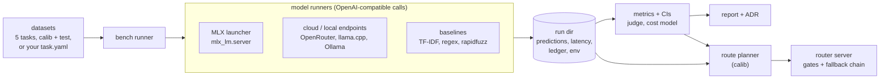

# local-enough

**Measured answers to "can we run this back-office AI task on our own hardware, and what does it cost?"**

local-enough runs one fixed suite of back-office tasks (CRM extraction, intent classification, PII redaction, meeting
summaries, vendor-record deduplication) against local models on Apple Silicon and against cloud models. It reports
accuracy against gold labels with confidence intervals, output validity, p50/p95 latency, throughput, USD per 1,000
tasks including amortised hardware and energy, and the monthly volume at which the local machine breaks even. It
writes a decision report with a filled-in ADR, then serves an OpenAI-compatible router that sends each task to the
cheapest model that met the quality bar and escalates when deterministic evidence checks fail.

<!-- le:headline:start -->
<!-- le:headline:end -->


The routing plan the reference run produces (`local-enough route --print-plan --run reference`):

<!-- le:plan:start -->
<!-- le:plan:end -->

## Quickstart

Python 3.12 and [uv](https://docs.astral.sh/uv/). One command runs the CLI without installing anything:

```bash
uvx --from git+https://github.com/B0yko/local-enough@v0.1.0 local-enough --help
```

The steps below use `uv tool install git+https://github.com/B0yko/local-enough@v0.1.0`, which puts
`local-enough` on your PATH. Steps 1 and 2 take under 5 minutes.

**1. Offline, no keys.** Reproduce every table in this README from the committed reference run:

```bash
local-enough report --run reference --out report/      # report/index.html, report.md, ADR-local-vs-cloud.md
local-enough route --simulate --run reference          # the mixed-workload router table
```

**2. Live, one OpenRouter key, under $0.05.** One inexpensive cloud model and the three non-LLM baselines on 10
calib items per task:

```bash
local-enough init my-eval && cd my-eval               # config.yaml, quickstart.yaml, local.yaml, route.yaml, ...
export OPENROUTER_API_KEY=...                          # or put it in .env (see .env.example)
local-enough bench --tasks all --models quickstart.yaml --split calib --limit 10 --dry-run   # estimate first
local-enough bench --tasks all --models quickstart.yaml --split calib --limit 10
local-enough report
```

**3. Local, no key (Apple Silicon).** Download the 1.5B model (0.88 GB), benchmark it, serve it behind the router
and call it with the official `openai` client:

```bash
local-enough models pull --models local.yaml
local-enough bench --tasks all --models local.yaml --split calib --limit 10 --run runs/local
local-enough route --run runs/local --models local.yaml   # serves http://127.0.0.1:8000/v1
```

```python
from openai import OpenAI

client = OpenAI(base_url="http://127.0.0.1:8000/v1", api_key="unused")
reply = client.chat.completions.create(
    model="local-enough/classification",
    messages=[{"role": "user", "content": "My card still hasn't arrived after two weeks"}],
)
print(reply.choices[0].message.content, reply.model)   # the label, and the model that answered
```

For exact reproduction of the reference environment use `git clone https://github.com/B0yko/local-enough && cd
local-enough && uv sync --locked` (`uvx --from git+...` ignores `uv.lock`; the `mlx` and `mlx-lm` lower bounds are
the benchmarked versions). On Linux `mlx-lm` is not installed and only cloud and OpenAI-compatible endpoints are
available.

## How it works



1. **Bench.** Every model sees the same prompt and the same lenient parser (code fences and `<think>` stripped, first
   JSON value or first line), at temperature 0 with a per-task output cap. Unparseable or schema-invalid output is
   scored as wrong and counted in `invalid_output_rate`; there are no repair retries. Cloud calls run with bounded
   concurrency and up to 3 retries on 429/5xx/timeouts. Local `launch: mlx` models are started and stopped by the CLI
   (`python -m mlx_lm.server` on 127.0.0.1, offline, pinned snapshot). Every paid call goes through one cost ledger
   that reserves an upper bound before sending and refuses calls that would pass the budget cap.
2. **Measure.** Pass A gives quality and per-item latency (local at concurrency 1), Pass B throughput at
   concurrency 4, Pass C a 20-minute soak for the throttle factor; peak memory comes from `footprint`, power from
   battery telemetry where it exists. A load sampler marks any measurement window with other work on the machine.
3. **Cost.** Local cost per task = amortised hardware + idle energy spread over the task's monthly volume, plus
   energy per task at sustained throughput; break-even and capacity follow ([docs/cost-model.md](docs/cost-model.md),
   [ADR 4](docs/adr/0004-cost-model.md)).
4. **Judge.** Summaries are graded by an LLM judge whose per-fact verdicts feed a pass rule in code; the judge is
   calibrated on construction-labelled summaries and its pass rate is bias-corrected (Rogan–Gladen).
5. **Route.** The planner keeps, per task, the candidates that met the quality bar on `calib`, orders them by USD per
   task and builds a fallback chain. The router applies the benchmarked prompt, runs deterministic gates and escalates
   on errors or failed gates ([ADR 1](docs/adr/0001-deterministic-gates.md)).

## Results

Reference run on a Mac Studio (2025, Apple M4 Max 16-core CPU / 40-core GPU, 128 GB), four cloud models on
OpenRouter and three baselines. Every table below is generated from the committed run by `local-enough report --run
reference` or `local-enough route --simulate --run reference`, and CI fails if the README drifts from it
(`scripts/check_readme.py`).

### Setup

<!-- le:setup:start -->
<!-- le:setup:end -->

### Quality, latency and cost per task

`calib` decides every routing choice and verdict; every number shown is on `test`.

<!-- le:results:start -->
<!-- le:results:end -->

| | | |
|---|---|---|
|  |  |  |
|  |  | |

### Local performance

<!-- le:local_perf:start -->
<!-- le:local_perf:end -->

### Break-even (dedicated machine)

<!-- le:break_even:start -->
<!-- le:break_even:end -->

<!-- le:sensitivity:start -->
<!-- le:sensitivity:end -->

### Verdict per task

<!-- le:verdicts:start -->
<!-- le:verdicts:end -->

### Router on the mixed workload (shared machine)

<!-- le:router:start -->
<!-- le:router:end -->

### Router live check

<!-- le:live_check:start -->
<!-- le:live_check:end -->

### Summarisation judge

<!-- le:judge:start -->
<!-- le:judge:end -->

### Downloads and spend

<!-- le:downloads:start -->
<!-- le:downloads:end -->

<!-- le:spend:start -->
<!-- le:spend:end -->

## Bring your own task

Point a `task.yaml` at your own `calib.jsonl` and `test.jsonl` for any of the five task kinds and add it to the
selection; bench, report and route then work unchanged:

```bash
local-enough datasets validate my-task/
local-enough bench --tasks all,my-task/task.yaml --models config.yaml
```

The JSONL fields per kind and the `task.yaml` fields are in [docs/add-your-task.md](docs/add-your-task.md);
[examples/custom-task/](examples/custom-task/) is a small made-up support-ticket classifier with a `train.jsonl`
for the TF-IDF baseline.

## The router

`local-enough route --models config.yaml` serves the plan built from a run (`--run`, default the reference run) on
`127.0.0.1:8000`:

- `POST /v1/chat/completions` with `model: local-enough/<task>` and the raw input as the user message; the router
  applies the benchmarked prompt and returns the parsed output as the message content (non-streaming);
- `GET /v1/models` lists the task aliases, `GET /healthz`, `GET /stats` (counts, escalations, latency, spend only);
- headers `x-local-enough-model`, `x-local-enough-escalated`, `x-local-enough-gate`;
- tasks in `data_must_stay_local` never reach a cloud endpoint: an exhausted local chain returns HTTP 503
  `local_only_unavailable`, and a local-only task with no local candidate above the bar returns 503
  `local_only_below_bar` unless `allow_below_bar_local: true`.

Any tool that takes an OpenAI-compatible base URL can point at it. There is no authentication
([SECURITY.md](SECURITY.md)); request and response bodies are never logged. `--print-plan` prints the plan,
`--simulate` replays it over the recorded test predictions, and `local-enough route replay --url ... --run ...`
sends mixed test items through a running router and compares its decisions with the simulation.

**Docker.** `docker compose up` runs the router image `ghcr.io/b0yko/local-enough:0.1.0`; local models stay on the
host because MLX needs Metal. Exact flags, and when a host flag would expose the model server on the LAN, are in
[docs/docker.md](docs/docker.md).

## Configuration

`config.yaml` holds the models (local `launch: mlx` or `base_url`, cloud, baselines), the judge candidates, the
budget and the hardware cost inputs; `route.yaml` holds the quality bars, latency caps, `data_must_stay_local`, the
workload mix and the monthly volume. Every field is documented in [docs/configuration.md](docs/configuration.md);
`local-enough init` writes commented examples. Keys come only from environment variables (`OPENROUTER_API_KEY`,
`LOCAL_ENOUGH_BUDGET_USD`, `LOCAL_ENOUGH_HOME`).

## Data

<!-- le:data:start -->
<!-- le:data:end -->

Four datasets are generated by `scripts/build_datasets.py --seed 7` from hand-written templates with no LLM in the
loop, so every gold label is exact by construction; details, counts and hashes are in [DATASETS.md](DATASETS.md).
The judge sets are construction-labelled, not human-labelled.

## Alternatives

- **General gateways** route on availability, latency or price, not on measured accuracy on your task: the
  [LiteLLM router](https://docs.litellm.ai/docs/routing) (weighted, least-busy, latency- and cost-based strategies)
  and OpenRouter's [provider routing](https://openrouter.ai/docs/features/provider-routing), which picks the
  upstream provider for a chosen model.
- **Learned routers** decide from data you don't control or send elsewhere: OpenRouter's
  [Auto Router](https://openrouter.ai/docs/features/model-routing) chooses from aggregate usage on OpenRouter;
  [RouteLLM](https://github.com/lm-sys/RouteLLM) ships routers trained on preference data such as Chatbot Arena;
  [Not Diamond](https://docs.notdiamond.ai/docs/what-is-model-routing) custom routers are trained on your evaluation
  data through its hosted service; [Martian](https://docs.withmartian.com/) routes across hosted models behind one
  API. None of them costs hardware you own.
- **Speed-only local benchmarks** such as [`llama-bench`](https://github.com/ggml-org/llama.cpp/tree/master/tools/llama-bench)
  and `mlx_lm.benchmark` report prompt and generation throughput and memory, not whether a model gets your task
  right or returns valid output.
- **General leaderboards** rank general capability, not your task, your output format or your cost per month.

## Limitations

- Four of the five datasets are template-generated and more regular than real mail, so scores on real data may be
  lower; that is why bring-your-own tasks exist.
- One measured machine (a Mac Studio M4 Max); other hardware can only be entered as cost inputs.
- English only.
- Prices are as of the snapshot date in the run.
- Confidence intervals are wide at n = 80–308 per task.
- Power: the measured machine is a desktop with no battery telemetry, so energy uses configured watts from Apple's
  published figures (labelled "configured"); on laptops `power-probe` reads undocumented battery telemetry and the
  result is an estimate.
- The summarisation judge is calibrated on construction-labelled summaries, not human labels.
- `data_must_stay_local` is a routing control, not a GDPR-compliance claim.
- The router serves only the benchmarked task prompts, without streaming.

## Roadmap

- Passthrough prompts and streaming in the router.
- A `judge label` command for 30–50 human labels to calibrate the judge.
- Measured profiles for llama.cpp, Ollama and NVIDIA/Linux machines.
- Automatic price refresh with drift alerts.

## Licence

Apache-2.0 ([LICENSE](LICENSE)); the bundled BANKING77 data is CC-BY-4.0 ([NOTICE](NOTICE)). Copyright 2026 Andrii
Boiko.
